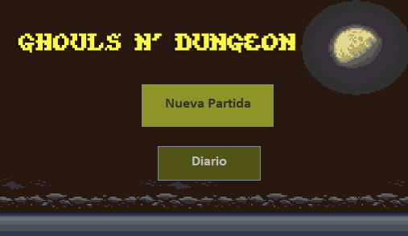
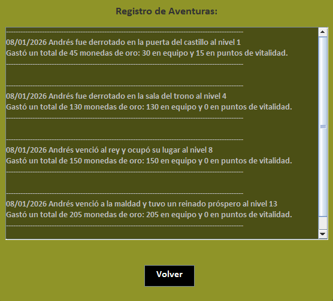
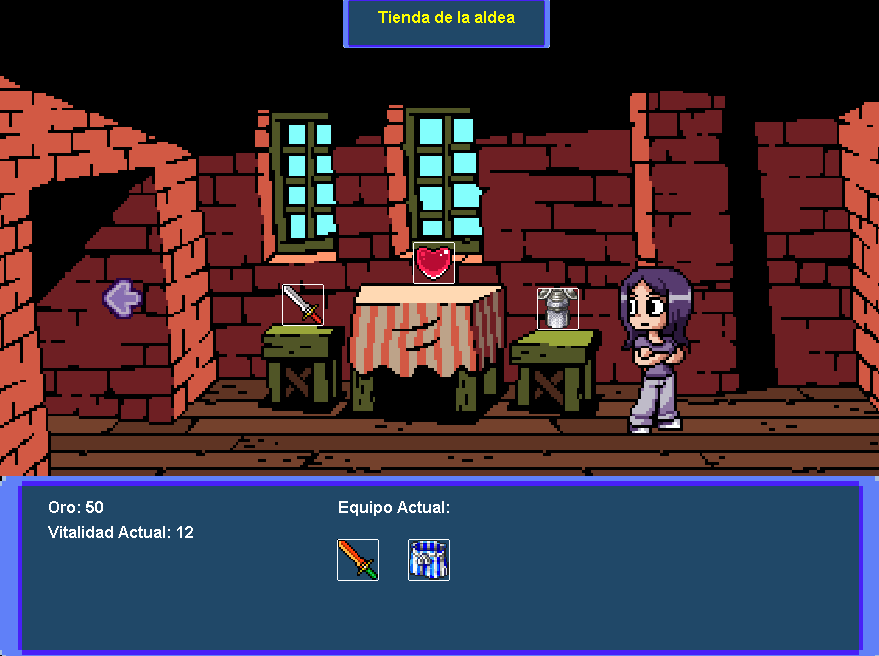
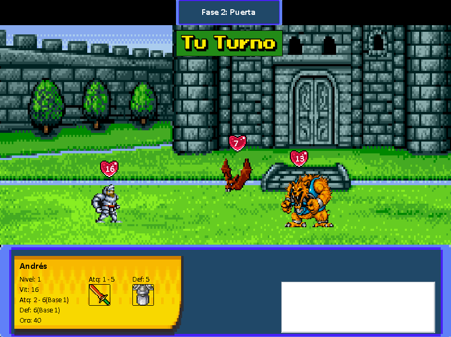
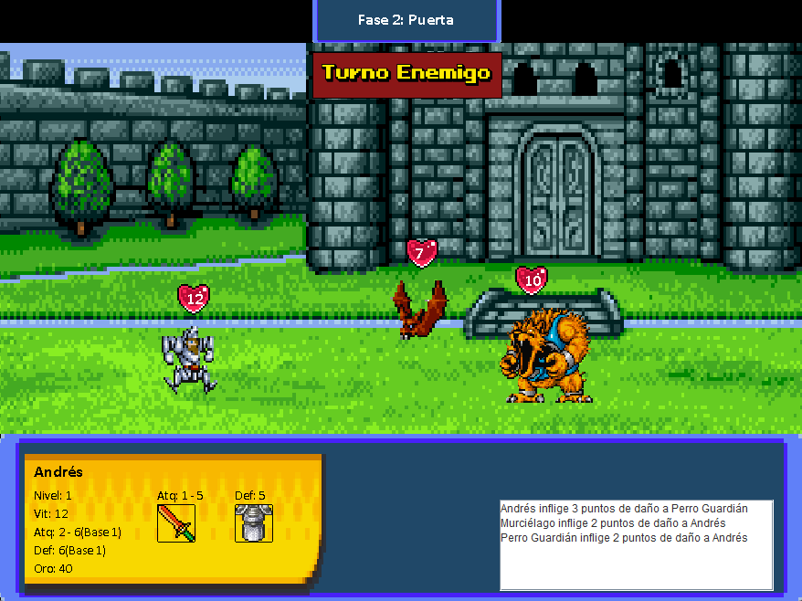
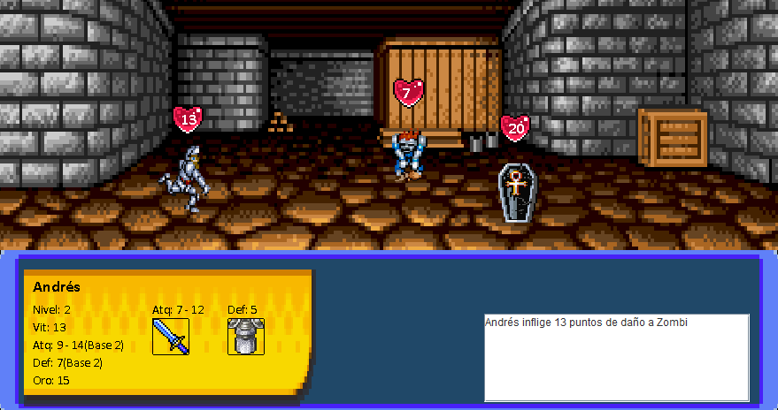
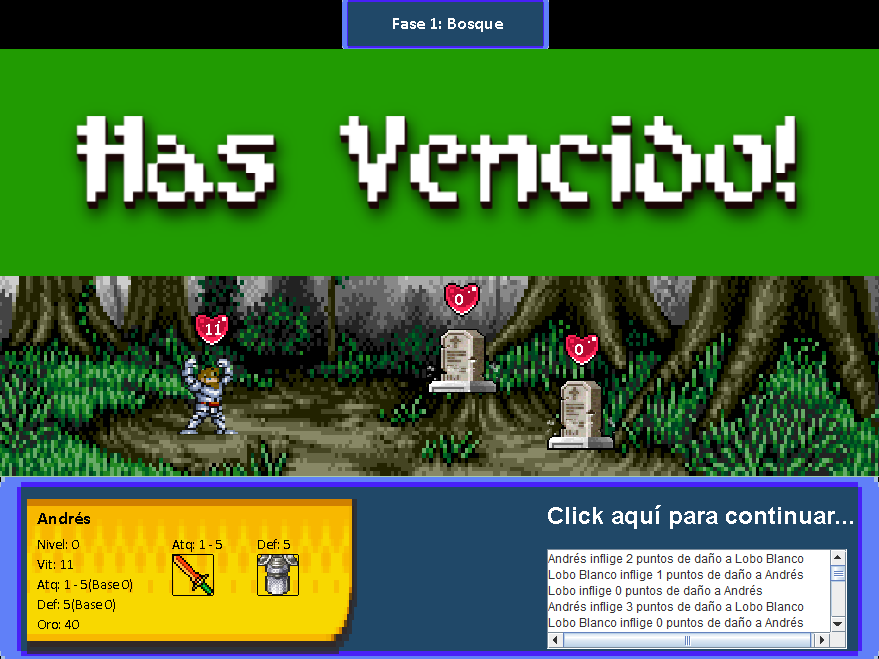
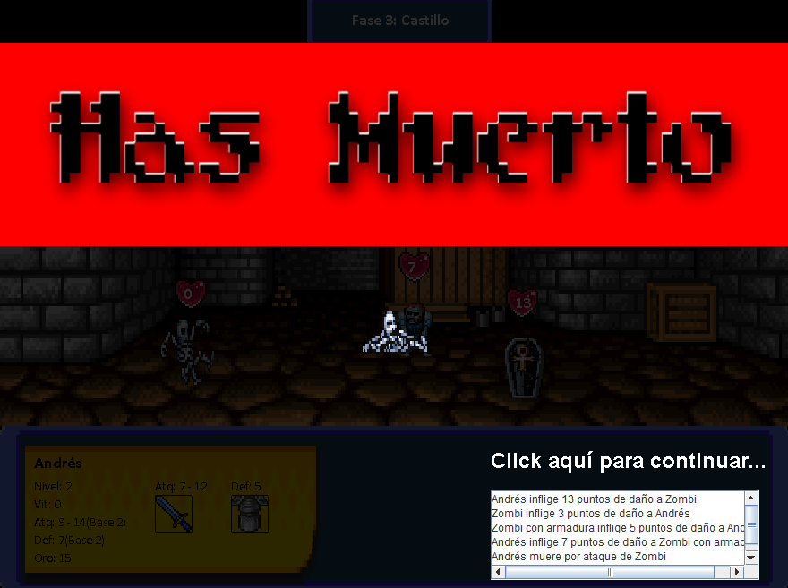

# Ghouls N' Dungeon

> RPG de combates por turnos con estética pixel art, sistema de progresión y persistencia completa en MySQL. Desarrollado en Java con Swing y Maven.

---

## Sobre el juego

Ghouls N' Dungeon es un RPG de acción por turnos en el que el jugador crea un héroe y lo lleva a través de una mazmorra dividida en **cuatro fases** con escenarios y enemigos distintos. El objetivo es sobrevivir hasta derrotar al jefe final: el Rey Maldito.

Entre algunas fases, el jugador puede visitar la **Tienda de la Aldea** para comprar equipo con el oro ganado en los combates, lo que añade una capa de gestión de recursos y toma de decisiones.

Todas las partidas —victorias y derrotas— quedan registradas en una base de datos MySQL, que el juego consulta para mostrar el **Diario de Aventuras** con el historial completo del jugador.

Si el héroe muere, su nivel y su oro se guardarán para el siguiente intento. Siempre que el jugador no vuelva al menú principal.

---

## Algunas capturas de pantalla

| Menú Principal | Diario de Aventuras |
|---|---|
|  |  |

| Tienda | Tu Turno |
|---|---|
|  |  |

| Fase 2: Turno Enemigo | Fase 3: Interior del Castillo |
|---|---|
|  |  |

| Victoria | Derrota |
|---|---|
|  |  |

---

## Sistema de combate

El combate es por turnos y enfrenta al héroe contra **varios enemigos simultáneamente** por fase. La lógica sigue este flujo:

```
Inicio de fase
    └─► Tu Turno
            └─► El héroe ataca a un enemigo aleatorio
                    └─► Se calcula el daño: Atq_héroe - Def_enemigo (con variación aleatoria)
                            └─► Si el enemigo muere → se retira del combate, el jugador gana oro
    └─► Turno Enemigo
            └─► Cada enemigo vivo ataca al héroe
                    └─► Se calcula el daño: Atq_enemigo - Def_héroe
                            └─► Si Vit_héroe = 0 → Game Over
    └─► Si todos los enemigos mueren → Victoria de fase → subida de nivel + acceso a tienda
```

Cada acción queda reflejada en tiempo real en el **log de combate**, que registra daño infligido, enemigos eliminados y oro obtenido.

---

## Progresión del héroe

El héroe sube de nivel al superar cada fase. Con cada nivel, sus estadísticas base mejoran automáticamente:

| Estadística | Descripción |
|-------------|-------------|
| **Vitalidad (Vit)** | Puntos de vida. Al llegar a 0, el héroe muere. |
| **Ataque (Atq)** | Rango de daño que inflige. Crece con el nivel y el equipo. |
| **Defensa (Def)** | Reducción del daño recibido. Crece con el nivel y el equipo. |
| **Oro** | Moneda ganada al derrotar enemigos. Se gasta en la tienda. |

Además del nivel base, el equipo comprado en la tienda (armas y armaduras) añade bonificadores adicionales que se muestran entre paréntesis en la ficha del héroe.

---

## Fases del juego

El juego está estructurado en cuatro fases con escenarios únicos y enemigos propios:

| Fase | Escenario | Enemigos |
|------|-----------|----------|
| **1** | Bosque | Lobos, insectos |
| **2** | Puerta del Castillo | Murciélagos, Perro Guardián |
| **3** | Interior del Castillo | Zombis, Zombis con Armadura |
| **4** | Sala del Trono | Rey Maldito, Fantasma |

---

## Tienda

Entre ciertas fases, el jugador accede a la tienda donde puede comprar:
- **Armas**: aumentan el ataque base del héroe
- **Armaduras**: aumentan la defensa base del héroe
- **Pociones de vida**: recuperan vitalidad

La decisión de gastar oro en equipo o guardarlo implica una gestión estratégica de recursos: invertir en equipo facilita las fases siguientes pero reduce el oro que quedará reflejado en el Diario.

---

## Persistencia de datos con MySQL

Al terminar cada partida (victoria o derrota), el juego guarda automáticamente un registro en la base de datos con:
- **Fecha** de la partida
- **Nombre** del héroe
- **Resultado** (victoria / derrota) y fase en la que ocurrió
- **Nivel** alcanzado
- **Oro total gastado** en equipo y en pociones de vida

El **Diario de Aventuras** recupera todos estos registros y los presenta ordenados cronológicamente, permitiendo al jugador ver su historial completo de aventuras.

---

## Tecnologías utilizadas

| Tecnología | Uso |
|-----------|-----|
| **Java SE** | Lenguaje principal |
| **Java Swing** | Interfaz gráfica, renderizado de escenas y animaciones |
| **MySQL** | Base de datos relacional para persistencia de partidas |
| **JDBC** | Conexión Java ↔ MySQL |
| **Maven** | Gestión de dependencias y build del proyecto |
| **Eclipse IDE** | Entorno de desarrollo |

---

## Conceptos técnicos aplicados

- **Patrón DAO** para separar la lógica de acceso a datos del resto de la aplicación
- **POO avanzada**: herencia y polimorfismo en la jerarquía `Personaje → Héroe / Enemigo`
- **Gestión de estados del juego**: máquina de estados que controla la transición entre menú, tienda, combate y resultados
- **Modelado relacional** de entidades del juego (héroe, enemigo, partida, registro)
- **Gestión de dependencias** con Maven y `pom.xml`

---

